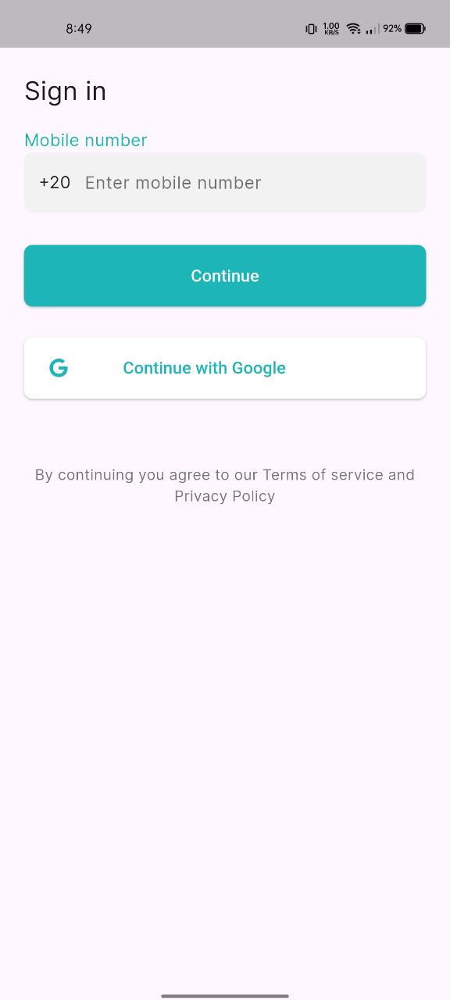

# 🏥 Patient Appointment Management App

A cross-platform Flutter application designed to help patients easily book and manage medical appointments while allowing doctors/admins to handle their schedules efficiently.  
This app is **offline-first** and uses **Hive** for local storage, so all data persists across restarts without the need for a backend.

---

## 🔧 Tech Stack
- **Framework:** Flutter (Dart 3.x, Flutter SDK 3.22+)
- **State Management:** Provider
- **Database:** Hive & hive_flutter
- **Utilities:** intl (dates), uuid (IDs)
- **Notifications:** flutter_local_notifications

---

## 🛠️ Getting Started

### 1. Clone the repository
```bash
git clone https://github.com/honda20200/maim-project.git
cd patient_appointment
```

### 2. Install dependencies
```bash
flutter pub get
```

### 3. Run the project
```bash
flutter run
```

### 4. Build APK
```bash
flutter build apk --release
```


---

## 📌 Core Features
- **Mock Authentication** → Login with phone & OTP (any 6-digit code is accepted).
- **Doctor Directory** → Browse doctors, filter by specialty and availability.
- **Appointments** → Book, reschedule, and cancel with proper validation.
- **Status Tracking** → Pending → Approved/Declined → Completed/Cancelled.
- **Tabs** → Upcoming, Missed, and Completed appointments.
- **Doctor/Admin View** → Approve, decline, or reschedule requests.
- **Notifications** → Local reminder 1 hour before appointment.
- **Persistence** → All data saved locally using Hive.

---

## 🧩 Architecture Overview

### 🔹 Data Layer
- Works with Hive and repositories.  
- Maps raw data (JSON, DB) to Dart objects.

### 🔹 Domain Layer
- Business rules, entities, and repository contracts.  
- Pure Dart, no Flutter dependencies.

### 🔹 Presentation Layer
- Flutter UI + state management with Provider.  
- Handles user events and displays results.

---

## ✅ Why This Setup?
- Clear separation of responsibilities (Clean Architecture).
- Scalable structure: new features can be added independently.
- Easy to write unit and widget tests.
- Ensures offline availability with local persistence.

---

## 📷 Screenshots

| Onboarding | Sign In | doctor|
|--------|------------|------------|
|  |  |  |

| patient | doctor |
|-----|-----------|
|  |  | 
---

## 🧪 Testing
- Unit tests for appointment rules:
  - Prevent double booking.
  - Disallow past dates.
  - Ensure rescheduled slots keep original creation timestamp.
- One widget test for booking flow.

Run tests:
```bash
flutter test
```

---

## 🎥 Demo

https://drive.google.com/drive/folders/1ty692CI2TV0FmCfw-WPN4cSvs_NbD4B5
---

## 🎨 Design Reference
This app was inspired by a Figma community resource:  
[Patient Appointment App UX/UI Case Study](https://www.figma.com/community/file/1345271545206228664/patient-appointment-app-ux-ui-case-study)
